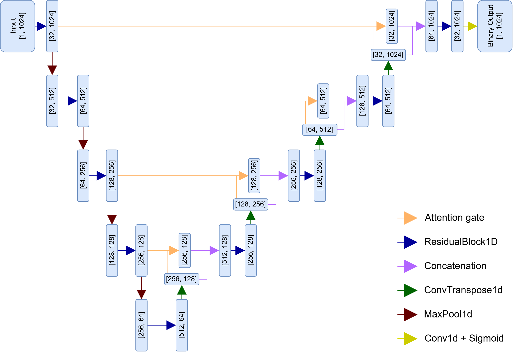

# autoSWD

This repository provides a full pipeline for **automated spike-and-wave discharge (SWD) detection** in **GAERS rats** using **Continuous Wavelet Transform (CWT)** in a **hybrid CNN + multi-kernel Conv1D model with attention** and an **Attention-ResUNet model**.

## Data
Data is created using EDF files and Excel annotations. The workflow is optimized for **09:00–12:00 recordings**, following the experimental protocol.

- EDF files containing the EEG data could be found in the Google Drive link [here.](https://drive.google.com/drive/folders/1bqY_G_6VvcQRkN-f3o6o6yZmAjfwrB9j?usp=drive_link)

- Excel files containing start-end times and durations of marked SWDs could be found [here](https://github.com/omerdemir2k4/autoSWD/tree/main/Data/excel_file).

## CWT-Hybrid CNN Architecture

## Attention-ResUNet Architecture

    

